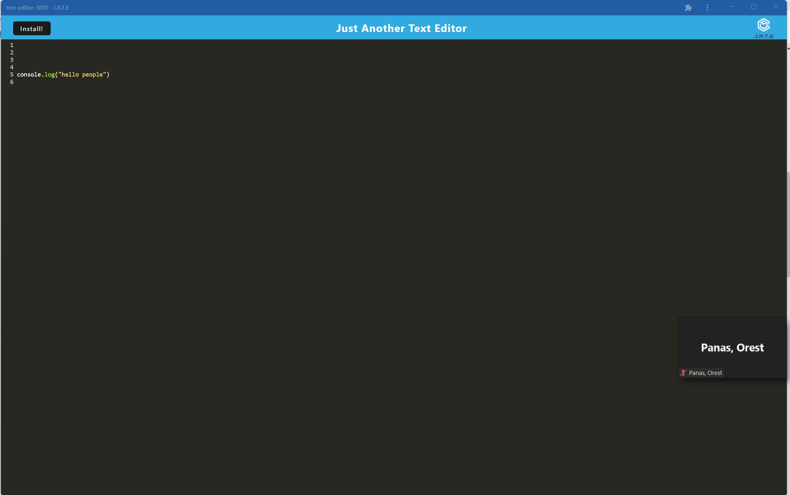
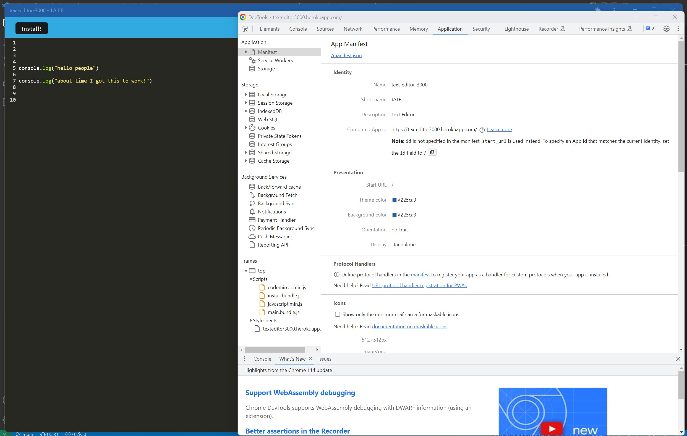
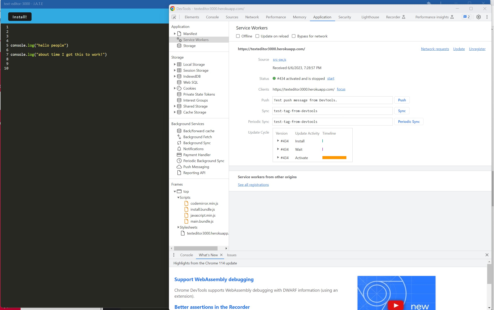
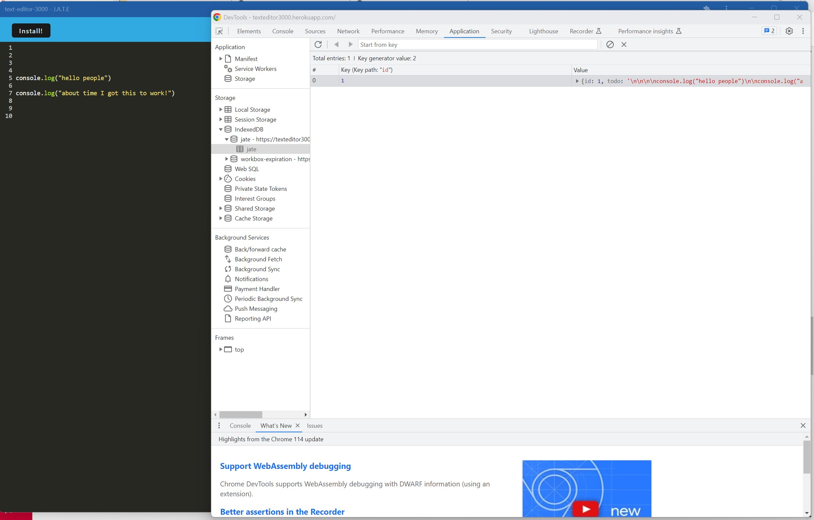

# TEXT-EDITOR-3000

[](https://opensource.org/licenses/MIT)

## Deployed Application Link
[Click Here!](https://texteditor3000.herokuapp.com/)

## Description
This text editor is a single-page application that meets the progressive web app criteria. This application features a number of data persistence techniques that serve as redundancy in case one of the options is not supported by the browser. The application will also function offline.

## Table of Contents
- [TEXT-EDITOR-3000](#text-editor-3000)
  - [Deployed Application Link](#deployed-application-link)
  - [Description](#description)
  - [Table of Contents](#table-of-contents)
  - [Installation](#installation)
  - [Screenshots](#screenshots)
  - [Usage](#usage)
  - [License](#license)
  - [How to Contribute](#how-to-contribute)
  - [Tests](#tests)
  - [Questions](#questions)

## Installation
```md
1. Download all the files here
2. Install node.js
3. Type: npm i to install all the packages
4. Open app
5. Optional: Press the install button on the application for just the app.
```
## Screenshots






## Usage
This project is used to demonstrate my knowledge of progresive web applications. 

## License
[!License: MIT](https://choosealicense.com/licenses/mit/)

## How to Contribute
N/A

## Tests
```md
After installation:
1. npm run seed
2. npm run dev:start
3. Create a note and reload the page.
4. Edit notes and reload the page. 
5. Delete the notes and reload the page.
```

## Questions
contact me here: JBETHUNE37@GMAIL.COM